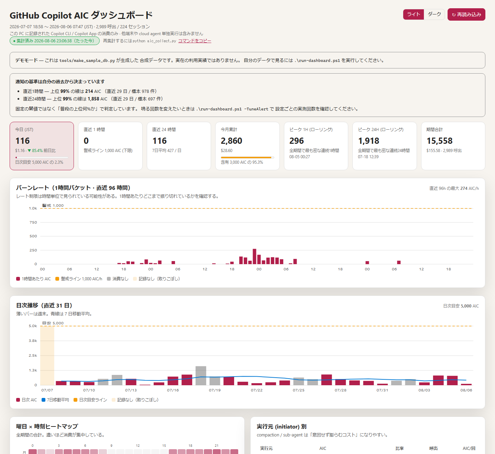

# GitHub Copilot AIC ダッシュボード

[English README](README.md) · [デモ（合成データ）](https://aktsmm.github.io/copilot-aic-dashboard/demo/)

自分の **GitHub Copilot AI Credits (AIC)** 消費を、ローカルだけで、**1 時間単位**で見るためのダッシュボードです。公式レポートは日次までなので、この粒度は公式では得られません。

> **なぜ 1 時間単位か。** レート制限に当たったとき知りたいのは「その 1 時間で何 AIC 焼いたか」です。日次平均では分かりません。



---

## 1. これが解決する問題

`~/.copilot/session-store.db` には Copilot CLI / App が書いたリクエスト単位の利用ログが入っています。ただし:

1. **消える。** Copilot 自身が古い行を刈るうえ、手動で消す人も多い。消えた瞬間、履歴も消えます。
2. **集計されていない。** 生の行があるだけで、時間バケットもコスト表示もありません。
3. **公式レポートは日次のみ。** 1 時間のスパイクは見えません。

このプロジェクトは:

- 利用行を **`~/.copilot` の外にある追記専用 DB へアーカイブ**します。ローカル DB を消しても履歴は残ります。
- アーカイブから集計し、依存なしの単一 HTML ダッシュボードを生成します。
- 履歴が失われた可能性のある区間を **「消費 0」として描かず、欠測として明示**します。

```
~/.copilot/session-store.db  ──(読み取り専用)──▶  archive.db  ──▶  data/usage.js  ──▶  index.html
      いつ消えてもよい                          消してはいけない資産      再生成            静的ファイル
```

---

## 2. クイックスタート

**前提:** Windows + PowerShell 5.1/7+、Python 3.9 以上。pip パッケージ不要。

```powershell
git clone https://github.com/aktsmm/copilot-aic-dashboard.git
cd copilot-aic-dashboard
.\setup.ps1
```

`setup.ps1` は前提確認 → アーカイブ保存先の決定（既定 `~/.copilot-aic/archive.db`）→ 初回収集 → 1 時間ごとの自動収集タスク登録まで行います。環境固有のパスは `config.local.json` に書き、追跡対象の `config.json` は変更しません。

スクリプトの実行が拒否される場合（`... はデジタル署名されていません` 等）は、そのセッションだけ許可してください。

```powershell
Set-ExecutionPolicy -Scope Process -ExecutionPolicy Bypass
```

タスク登録は権限によって失敗することがありますが、致命的ではありません。アーカイブ自体は動きます。`-InstallTask` はまず `Register-ScheduledTask` を試し、CIM プロバイダがポリシーで拒否された場合（企業管理端末でよくある「アクセスが拒否されました」）は自動的に `schtasks.exe` にフォールバックします。こちらは管理者権限なしでも通ることが多いです。両方失敗した場合は手動登録用のプログラム/引数を表示します。`.\setup.ps1 -SkipTask` で登録を省略し、見たいときだけ `.\run-dashboard.ps1` を実行する運用でも構いません。

自分のデータなしで見た目だけ試すなら:

```powershell
.\run-dashboard.ps1 -Demo
```

### 日常の操作

```powershell
.\run-dashboard.ps1                      # 収集してブラウザで開く
.\run-dashboard.ps1 -Stats               # アーカイブの統計だけ表示
.\run-dashboard.ps1 -Verify              # AIU→AIC 換算の再検証も実行
.\run-dashboard.ps1 -Reconcile           # Copilot App の集計と突き合わせて取りこぼしを検出
.\run-dashboard.ps1 -CheckAlert          # 現在どの閾値を超えているかを表示（通知はしない）
.\run-dashboard.ps1 -TestAlert           # デスクトップ通知のテスト
.\run-dashboard.ps1 -BackupTo D:\backup  # アーカイブを安全に複製
.\run-dashboard.ps1 -ExportCsv .\export\usage.csv # 全イベントを CSV 出力
.\run-dashboard.ps1 -UninstallTask       # 自動収集を解除
```

収集は既定で 1 時間おきです。`-InstallTask -IntervalMinutes 180` のように指定すれば変更でき、`-InstallTask` を実行し直せば既存のタスクを置き換えます。タスクはコンソールを持たない `pythonw.exe` で動くので、画面には何も出ず、作業中のアクティブウィンドウも奪いません（数時間おきに窓がちらつくバックグラウンド処理は、遅かれ早かれ消されます）。

間隔をどう変えても、ダッシュボード側が追随します。実際に収集が何分おきに走っているかを測り、その 1.5 倍を超えたときだけ「集計が古い」と言います。固定のしきい値にすると、間隔を変えた瞬間にどちらかが必ず誤ります。また、集計から 10 分以上経っている場合は「直近 1 時間」「直近 24 時間」に集計時刻を併記します。これがないと、単に集計が古いだけの 0 を「使っていない」と読んでしまいます。

PowerShell を使わない場合:

```bash
python aic_collect.py          # 収集して data/usage.js を再生成
python aic_archive.py --stats  # アーカイブの統計
open index.html                # ブラウザで開く（file:// で動く）
```

---

## 3. 画面の見方

| パネル | 答える問い |
| --- | --- |
| **KPI** | 今日 / 直近1h / 直近24h / 今月累計 / 全期間のピーク1h・24h（ローリング） |
| **バーンレート（1時間）** | 1 時間でどこまで振り切れたか。スパイクはいつか |
| **日次推移** | 7 日移動平均と日次目安ラインの比較 |
| **時間×曜日ヒートマップ** | 実際に消費している時間帯はどこか |
| **モデル / 起動元 / 推論強度 / ホスト別** | どこに費用が流れているか |
| **リポジトリ別** | どのプロジェクトが高いか |
| **セッション表** | 上位セッションの要約、モデル構成、子エージェント比率 |
| **効率メトリクス** | キャッシュヒット率、入力100万トークンあたり AIC、推論トークン比率 |

すべて静的 HTML 1 枚と生成された `data/usage.js` だけです。サーバー不要、ビルド不要、テレメトリなし。

---

## 4. 安全性の保証

- **ライブ DB は読み取り専用で開きます**（`file:...?mode=ro` + `PRAGMA query_only=ON`）。書き換えません。db/-wal/-shm を個別コピーする方式は、逐次コピー中にチェックポイントが走ると不整合なスナップショットになるため採用していません。ロックされている場合は指数バックオフで再試行し、それでも駄目なら取り込みを見送ります（壊れたデータを書かない）。
- **アーカイブは追記専用。** 実績行に `DELETE` / `DROP` を実行しません。スキーマ移行も旧テーブルを DROP せず改名して残します。
- **外部通信は一切ありません。** コード中にネットワークアクセスは存在しません。
- **`data/` `export/` `sample/` は gitignore 済み**なので、自分の利用実績が誤ってコミットされることはありません。

### 4.1 キー設計 — なぜ `(session_id, id, created_at)` なのか

`assistant_usage_events.id` は `INTEGER PRIMARY KEY AUTOINCREMENT` なので、**DB を作り直すと 1 から振り直されます**。

| 候補 | 判定 |
| --- | --- |
| `id` 単独 | ✗ 再作成後、別世代の別イベントが既存行を上書き。黙って壊れ、復旧不能 |
| `(session_id, id)` | ✗ 復元・再開したセッションは同じ UUID で新世代 DB に現れうるため、同じ事故が起きる |
| 内容ハッシュ | ✗ 列が少し更新されただけで別キー → 二重計上 |
| **`(session_id, id, created_at)`** | ✓ 3 つとも不変の identity 列。同一 DB の再スキャンは冪等、再採番された `id` は別行として保存される |

`created_at` が取れない行は捨てず、`quarantine_events` テーブルへ隔離して件数を報告します。

### 4.2 欠測の扱い — 断定しない

イベントの時刻だけでは「DB を消された」のか「単に使っていなかった」のか区別できません。そこで収集のたびに **ソースファイルの世代**（`st_ino` / ctime / サイズ）を記録し、失敗した実行も含めて必ずログを残します。そのうえで確度を分けて報告します。

- **high** … ソースファイルが作り直され、かつ時系列も不連続 → 取りこぼしの可能性が高い
- **low** … 時系列が不連続なだけ → 単に使っていなかった可能性がある

該当区間はグラフで **高さ 0 のバーではなく網掛け帯**として描かれ、その区間を含む平均値には ⚠ が付きます。「記録なし」を「消費なし」と誤読しないためです。

### 4.3 同時実行

タスクスケジューラ実行と手動実行がぶつかっても壊れないように、ロックファイルで直列化し、アーカイブへの書き込みは `BEGIN IMMEDIATE` で開始します。`usage.json` / `usage.js` は同ディレクトリの一時ファイルへ書いてから `os.replace` で差し替えるため、ブラウザが書きかけの JS を読むことはありません。

---

## 5. ファイル構成

```
setup.ps1              初回セットアップ（前提確認 → 設定 → 初回収集 → タスク登録）
run-dashboard.ps1      日常運用（-Stats -Verify -Reconcile -CheckAlert -TestAlert -Demo -InstallTask -BackupTo -ExportCsv）
aic_archive.py         追記専用アーカイブ（マージ / 移行 / 欠測検出 / バックアップ / CSV / 複数マシン統合）
aic_collect.py         集計 → data/usage.json + data/usage.js
aic_alert.py           閾値超過をデスクトップ通知（重複抑制つき）
verify_pricing.py      トークン数と公式単価から AIC を再計算して突合
index.html             ダッシュボード本体（単一ファイル・依存なし）
config.json            設定
tools/make_sample_db.py  デモ・テスト用の合成 session-store.db 生成
docs/demo/             合成データから生成した公開デモ
AGENTS.md              このリポジトリを扱う AI エージェント向けの指示
```

---

## 6. AIU → AIC 換算の検証結果

**結論: `total_nano_aiu ÷ 1e9` は AI Credits そのもの。1 AIC = $0.01。**

`verify_pricing.py` で、GitHub 公式のモデル別トークン単価から AIC を再計算し、アーカイブの値と突合しました（10,955 件）。

> 以下の数値は筆者自身のアーカイブから出した**集計値のみ**です。セッション名・リポジトリ名・ユーザー識別子は含みません。手元で `.\run-dashboard.ps1 -Verify` を実行すれば、同じ表を自分のデータで再現できます。

確定した課金式:

```
AIC = ( (input_tokens - cache_read - cache_write) × input単価
      + cache_read   × cached_input単価
      + cache_write  × cache_write単価
      + output_tokens × output単価 ) ÷ 1,000,000 × 100
```

**`input_tokens` は `cache_read` と `cache_write` を内包しています**（3 つの仮説を検証して確定）。

| モデル | 件数 | 誤差2%以内の一致率 |
| --- | ---: | ---: |
| claude-opus-4.8 / gpt-5.5 / claude-sonnet-4.6 / claude-opus-4.6 / gemini-3.1-pro-preview / gpt-5.4 / claude-haiku-4.5 / gpt-5.4-mini | 511 | **100.0%** |
| claude-sonnet-5 | 1,090 | 99.6% |
| claude-opus-5 | 2,609 | 99.0% |
| gpt-5.6-sol | 3,019 | 93.8% |
| gpt-5.6-terra | 3,726 | 5.9%（下記） |

### gpt-5.6-terra のズレ = 期間中の値下げ

日別に実測/計算比を出すと階段状に変化しており、**単価改定の履歴**であることが分かりました。

| 期間 | 実測 / 現行公式単価 |
| --- | ---: |
| 〜 2026-07-14 | ×1.36 〜 1.46 |
| 2026-07-15 〜 07-29 | **×1.250**（きれいに一定） |
| 2026-07-30 | ×1.016（移行日） |
| 2026-08-03 〜 | **×1.000**（現行単価と完全一致） |

つまり計算式は正しく、**過去データが当時の高い単価で記録されている**だけです。`gpt-5.6-sol` / `claude-opus-5` の 1〜2% のズレも、長コンテキスト階層（272K 超で単価倍）の境界判定によるものです。

ダッシュボードは DB の `total_nano_aiu` をそのまま使うため、**過去の単価改定を含めて正確**です。

---

## 7. 「どのくらいで制限か」— 公式ドキュメントの回答

調査日: 2026-08-05。すべて docs.github.com が出典です。

### 7.1 AI Credits の含有量

| プラン | 標準 (user/月) | プロモーション (2026-06-01〜09-01) |
| --- | ---: | ---: |
| Copilot Business | 1,900 AIC | **3,000 AIC** |
| Copilot Enterprise | 3,900 AIC | **7,000 AIC** |
| Copilot Pro | 1,500 AIC | — |
| Copilot Pro+ | 7,000 AIC | — |
| Copilot Max | 20,000 AIC | — |

- 1 AI Credit = **$0.01 USD**
- Business / Enterprise は**ライセンス数の合計がプールされ、組織で共有**されます（個人ごとの上限ではない）
- 出典: [Usage-based billing for organizations and enterprises](https://docs.github.com/en/copilot/concepts/billing/usage-based-billing-for-organizations-and-enterprises) / [Models and pricing](https://docs.github.com/en/copilot/reference/copilot-billing/models-and-pricing)

### 7.2 レート制限 — **数値は公式に非公開**

公式ドキュメントは「レート制限は存在する」とだけ述べ、**具体的な数値もウィンドウ幅（時間単位か日単位か）も公開していません**。

> "Rate limiting is a mechanism used to control the number of requests a user or application can make in a given time period."
> "Rate limits are temporary. Often, waiting a short period and trying again resolves the issue."
>
> — [Usage limits for GitHub Copilot](https://docs.github.com/en/copilot/concepts/usage-limits)

公式が挙げるレート制限の理由は **Capacity / High usage / Fairness / Abuse mitigation** の 4 つです。

制限に達したときの公式の推奨対応は「待つ」「使用パターンを見直す」「プランをアップグレードする」。特に *"If you're making frequent or automated requests (for example, rapid-fire completions or large-scale usage), consider adjusting your usage pattern."* と明記されており、**並列スクラムのような高頻度・自動化された使い方は明示的に想定されています**。

### 7.3 クレジット枯渇による停止は「レート制限」とは別物

- AI Credits を使い切ることによる停止は **blocked** 扱いで、レート制限とは区別されます。
- 解除は次の請求サイクル開始か、管理者が予算を引き上げるまで。
- **追加使用（従量課金）はデフォルトで有効**です。管理者が明示的に無効化しない限り、含有分を超えても $0.01/AIC で使い続けられます。
- **予算のハードストップ（"Stop usage when budget limit is reached"）はデフォルト OFF**（Enterprise / Org / コストセンター予算）。ユーザーレベル予算のみ常にハードストップ。
- **しきい値アラート機能は公式にありません**（到達後のブロックのみ）。だからこそローカルで先回りして見る価値があります。
- 出典: [Budgets for usage-based billing](https://docs.github.com/en/copilot/concepts/billing/budgets-for-usage-based-billing)

### 7.4 Acceptable Use

GitHub AUP は *"excessive automated bulk activity"* や *"placing undue burden on our servers through automated means"* を禁じていますが、**Copilot 固有の定量的な並列実行制限は記載されていません**。

出典: [GitHub Acceptable Use Policies](https://docs.github.com/en/site-policy/acceptable-use-policies/github-acceptable-use-policies)

### 7.5 公式の可視化手段（日次まで）

| 手段 | 期間 | 粒度 |
| --- | --- | --- |
| Summarized usage report | 最長1年 | 日次・SKU別 |
| Detailed usage report | 最長31日 | 日次・ユーザー別 |
| **AI usage report** | 最長31日 | 日次・**モデル別・ユーザー別** |
| REST API `/enterprises/{ent}/copilot/metrics/reports/...` | 最長1年 | 日次 |

AI usage report の CSV 列: `date` / `model` / `username` / `quantity` / `gross_amount` / `discount_amount` / `net_amount`

**時間別の粒度は CSV にも API にも存在しません。** 本ダッシュボードの 1 時間バケットは公式では得られないビューです。

出典: [Billing reports reference](https://docs.github.com/en/billing/reference/billing-reports) / [REST API endpoints for Copilot usage metrics](https://docs.github.com/en/rest/copilot/copilot-usage-metrics)

### 7.6 「premium requests」との関係

- 2026-06-01 に全有料プランが usage-based billing (AI Credits) へ移行。
- 旧「premium requests」＋モデル倍率は、**年間プランにとどまった個人の Pro / Pro+ のみ**に残存（レガシー）。
- Business / Enterprise は完全にトークンベースです。
- 出典: [Requests in GitHub Copilot (legacy)](https://docs.github.com/en/copilot/reference/copilot-billing/request-based-billing-legacy/copilot-requests)

### 7.7 公式に確認できなかったこと

| 項目 | 状況 |
| --- | --- |
| レート制限の具体的数値 | **非公開** |
| レート制限のウィンドウ幅（1時間 / 1日 / ローリング） | **非公開** |
| `total_nano_aiu` の公式定義 | 記載なし（本 README の実測検証で AIC と同値と確認） |
| sub-agent / 並列エージェントの課金方式 | 明示なし（トークン消費として計上されると読める） |
| コンテキスト compaction の課金 | 明示なし（実測では消費している） |
| 予算のしきい値アラート | **機能なし** |

---

## 8. 設定 (`config.json`)

| キー | 既定値 | 説明 |
| --- | --- | --- |
| `db_path` | `null` | `null` で `%USERPROFILE%\.copilot\session-store.db` を自動検出 |
| `archive_db` | `~/.copilot-aic/archive.db` | 追記専用アーカイブ。環境変数 `AIC_ARCHIVE_DB` で上書き可 |
| `app_db` | `~/.copilot/data.db` | `-Reconcile` の検算元（読み取り専用）。無ければスキップ |
| `tz_offset_hours` / `tz_label` | `9` / `"JST"` | 集計に使うタイムゾーン |
| `aiu_to_aic` | `1.0` | AIU → AIC 換算係数（検証済み。通常変更不要） |
| `usd_per_aic` | `0.01` | 1 AIC の USD 単価 |
| `monthly_included_aic` | `3000` | 月間含有クレジット。プランに合わせて変更 |
| `daily_budget_aic` | `5000` | 日次目安ライン（グラフの破線）。24時間通知の**下限**も兼ねる |
| `hourly_alert_aic` | `1000` | 1時間あたりの警戒ライン。1時間通知の**下限**も兼ねる |
| `alerts_enabled` | `true` | 閾値超過時にデスクトップ通知する。`false` で無効化 |
| `monthly_alert_ratio` | `0.8` | 月間含有クレジットのこの割合を超えたら通知 |
| `baseline_enabled` | `true` | 1時間 / 24時間の閾値を自分の履歴から決める。`false` で固定値のみ |
| `baseline_days` | `30` | 基準を計算する遡り日数 |
| `baseline_min_days` | `7` | 履歴がこれ未満の間は基準を使わない |
| `baseline_min_samples` | `40` | 基準を信用するのに必要な非ゼロ窓の最小数 |
| `hourly_baseline_percentile` | `95` | 直近1時間が稼働時間の上位 5% に入ったら通知。`-TuneAlert` で自分に合う値を実測できる |
| `daily_baseline_percentile` | `90` | 同上（直近24時間） |
| `daily_days` / `hourly_hours` | `45` / `96` | 表示期間 |
| `top_sessions` | `40` | セッション表の表示件数 |
| `summary_max_chars` | `60` | JSON に書き出す summary の最大文字数 |

> セッションの完全な要約はローカルのアーカイブにのみ残り、`data/` へは切り詰めたものだけが書き出されます。

`config.json` は共有される設定です。自分の環境固有のパスは、同じ形式の **`config.local.json`**（gitignore 済み）に書くと上書きできます。

```json
{ "archive_db": "D:\\backup\\copilot\\archive.db" }
```

優先順位は 環境変数 `AIC_ARCHIVE_DB` > `config.local.json` > `config.json` > 既定値 です。

アーカイブの保存場所は `~/.copilot` の**外**にしてください。中に置くと Copilot 側の掃除に巻き込まれ、アーカイブごと消える恐れがあります。

---

## 9. 制限に当たる前に気づく

レート制限は**事後に検出できません**。ローカル DB には 429 もクォータエラーも一切記録されていないためです。したがって打てる手は「当たる前に警告する」しかありません。

収集のたびに次の 3 つを評価し、超えていればデスクトップ通知を出します。

| 種類 | 閾値 | 再通知の条件 |
| --- | --- | --- |
| 直近 1 時間 | 自分の p95（下限 `hourly_alert_aic`） | 時が変わったとき、または消費が**倍**になったとき |
| 直近 24 時間 | 自分の p90（下限 `daily_budget_aic`） | 日が変わったとき、または消費が**倍**になったとき |
| 今月累計 | `monthly_included_aic × monthly_alert_ratio` | 月が変わったとき、または消費が**倍**になったとき |

### 閾値は「誰かが決めた数字」ではなく自分の履歴から出す

固定値では成立しません。消費量は人によって桁が違うので、どんな初期値でも「永遠に鳴らない」か「鳴りっぱなし」のどちらかになります。実際、筆者のアーカイブでは既定の 5,000 AIC/日 は稼働日ならほぼ毎日超えており、同じ内容の通知が月 18 回出る状態でした。

そこで 1 時間と 24 時間の閾値は自分の過去から決めます。**「この 1 時間は普段の上位 N% に入るか」**で判定します。

うまく機能させるために必要なことが 3 つあります。

- **基準は通知と同じ測り方で作る。** どちらも移動窓で測ります。移動窓の合計は単一の時バケットより上振れしやすいので、時バケットの分布で基準を作ると想定より多く鳴ります。
- **消費ゼロの窓は除外する。** 全時間の約 8 割はゼロです。混ぜると基準がゼロ付近に沈み、稼働中はほぼ常時超過になります。
- **進行中の窓は自分の基準に入れない。** さもないと、捕まえたいスパイク自身が越えるべき線を押し上げ、いちばん激しく使っているときに限って黙ります。

同じ理由で、統計量は平均ではなくパーセンタイルです。平均はスパイクに引きずられます（筆者の日次は平均 7,211 AIC に対し中央値 1,225 AIC）。重い日が 1 日あるだけで、その月の残り全部の線が上がってしまいます。

`hourly_alert_aic` と `daily_budget_aic` は無効になったわけではなく、**下限**として効きます。「自分にとっては異常でも、この程度なら中断されたくない」という水準です。使い始めの数週間、基準がまだ小さいうちに効いてきます。履歴が `baseline_min_days` 日ぶんに満たない間は基準を使わず、固定値だけで判定します。

今月累計だけは絶対値のままです。実際の請求に対応するので、相対化する意味がありません。

### 通知頻度は「決め打ち」ではなく実測して選ぶ

パーセンタイルから通知回数を推測することはできません。超過は数回の評価にまたがって持続し、かたまって発生します。さらに使用量が増加傾向にあると、過去 30 日の基準がそれに追いつきません。なので測ります。

```powershell
.\run-dashboard.ps1 -TuneAlert
```

自分の履歴を再生し、**各時点で「そこまでに閉じた窓」だけから基準を作り直しながら**（後知恵を入れずに）、設定ごとの実際の通知回数を出します。標本を取る格子は暦ではなく現在時刻を起点に固定しているので、朝に流しても夜に流しても、同じ履歴なら同じ回数になります。

```
【直近1時間】config: "hourly_baseline_percentile"
   p90        3,259 AIC   月    56 回
   p95        4,641 AIC   月    39 回
   p99        6,253 AIC   月     6 回  ← 推奨
```

目標回数を変えるときは `-TargetAlertsPerMonth` を指定します。

### 再通知の考え方

「倍になったら」という条件が肝心です。1 日 1 回固定だと慣れて無視するようになり、毎回鳴らすとただの雑音になります。倍増したときだけ鳴らせば、「まずい」状態では静かなまま、「明らかに悪化した」ときだけ声を上げます。

**何が倍になったら鳴るのか**が重要です。覚えているのは「前回知らせたときの消費量」であって、「閾値の何倍だったか」ではありません。閾値は実行のたびに基準から計算し直すので動きます。動く物差しで測った比は実行間で比較できないうえ、動く向きが最悪です。大きく使っている最中は、その日の閉じた窓が基準の分布に入って閾値を押し上げるため、比で見ると消費が伸びているのに横ばいか縮んで見え、**いちばん知らせるべきときに黙ります**。消費量そのものを覚えておけば、「倍に増えた」は「倍に増えた」のままです。

```powershell
.\run-dashboard.ps1 -TestAlert    # 通知が出せるかの確認
.\run-dashboard.ps1 -CheckAlert   # 基準と現在値を表示。通知も状態更新もしない
```

通知は PowerShell 経由の Windows トースト API を使うので追加パッケージは不要です。トーストが出せなかった場合は標準出力に落とすため、握り潰されることはありません。

**表示に失敗した通知は「送った」と見なしません。** 状態を進めるのは通知に成功したときだけなので、一時的な失敗は次回の収集で再試行されます。加えて、届けられなかったものはダッシュボードにバナーとして出ます。定期タスクは `--quiet` で動くので標準出力を誰も見ていませんが、それでも見落とさないようにするためです。`"alerts_enabled": false` で全体を止められます。`"baseline_enabled": false` にすると従来どおり固定値だけになります。

重複抑制の状態はアーカイブの `meta` テーブル（`alert_state:*`）に保存されるので、再実行や再起動で鳴り直すことはありません。

---

## 10. 複数マシンをまとめて見る

アーカイブはマシンごとに独立しています（各マシンが自分のローカルストアから収集するため）。合算して見たい場合は、片方のアーカイブをコピーして取り込みます。

```powershell
python aic_archive.py --merge-archive D:\from-laptop\archive.db
python aic_archive.py --merge-archive D:\from-laptop\archive.db --origin laptop   # ラベルを明示
```

取り込みは**追記のみ・冪等**です。

- `usage_events` の主キーは `(session_id, id, created_at)` で、**マシン名を含みません**。同じイベントが両方にあっても 1 件しか残らず、同じファイルを 2 回取り込んでも合計は増えません。
- 既存行の UPDATE / DELETE は一切しません。新規に入った行にだけ origin が付きます。
- `collect_runs.run_id` は AUTOINCREMENT なので採番し直し、`(origin, ran_at, status, source_path)` で重複排除します。

欠測検出は**マシンごとに独立して**行います。これは見た目の問題ではありません。欠測の判定にはソース DB のファイル世代が実行間で変わったかを使っているため、2 台分の実行を 1 本の時系列に混ぜると世代が毎行入れ替わり、**すべての実行が高確度の欠測として誤検出**されます。origin で分割することが、この報告を意味のあるものに保つ条件です。

2 台以上を取り込むと、ダッシュボードにマシン別の内訳が出て、各欠測にどのマシンのものかが表示されます。

**ただし見えているのはスナップショットで、ライブビューではありません。** 取り込んだアーカイブは書き出した時点で固定されますが、相手のマシンはその後も消費し続けます。したがって、そのマシンの最終収集より後の期間は**このマシンの分しか入っていません**。合計もアラートもグラフも、実際より少なく出ます。ダッシュボードには各マシンの最終収集時刻を内訳の横に出しているので、どれだけ古いかは確認できます。最新化するには、向こうで収集してからもう一度マージしてください。

同じ理由で、アラートは「いまアーカイブに入っているもの」に対して評価されます。複数マシンを本格的に使っていてアラートに頼るなら、統合したビュー 1 つを信用するのではなく、各マシンでアラートを動かしてください。

> ラベルの既定値は取り込み元アーカイブのホスト名です。`docs/demo/` へは書き出されません（デモ生成時にパスと一緒に置き換えられます）。

---

## 11. 何が測れて、何が測れないか

このダッシュボードが読むのはローカルの Copilot CLI ストアです。Copilot デスクトップアプリが worktree 内で起動する CLI も同じストアに入るので対象ですが、課金対象すべてを見ているわけではありません。

| 消費元 | 対象 | 理由 |
| --- | --- | --- |
| この PC の Copilot CLI | **○** | `~/.copilot/session-store.db` にイベント単位で `total_nano_aiu` が入る |
| Copilot App のプロジェクトセッション（worktree） | **○** | ローカルで CLI を回すので同じストアに入る |
| サブエージェント / compaction | **○** | 個別イベントとして記録され `initiator` で判別できる |
| **Copilot Coding Agent** | **×** | GitHub のサーバー側で動く。ローカルに消費記録が存在しない |
| **Copilot Code Review** | **×** | 同上（サーバー側） |
| **VS Code Copilot Chat** | **×** | 別ストアで、usage テーブル自体が無い |
| **他の PC** | 取り込めば ○ | 端末ごとに別ストアを持つ。アーカイブを持ってくれば合算できる（[10. 複数マシン](#10-複数マシンをまとめて見る)） |

これはローカル側の実装で直せる問題ではありません。サーバー側で動くエージェントは、読み取るべき消費記録がそもそもローカルに存在しないためです。**Coding Agent を多用している場合、実際の消費はこのダッシュボードの数字より多くなります。** その分は GitHub の Billing 画面でしか確認できません。

<details>
<summary>この結論の検証方法</summary>

Copilot にはクラウド側のセッションストアもあるので、「他 PC の分も見えるのでは」と期待したくなりますが、以下の理由で使えませんでした。

- `total_nano_aiu` は持ちません。ただし input / output / cache read / cache write のトークン数は揃っているので、**AIC を逆算すること自体は可能**です。実際、両者が同じイベントを持っていた日では逆算値がローカル実績と完全一致しました（206 対 206 AIC）。
- しかし**カバレッジが不完全で、しかも不安定**です。10日分を逆算したところ、実績の **55%** しか再現できず、日別では 41〜100% とばらつきました。遅延のある部分ミラーなので、クラウド逆算値はローカル実績より確実に劣ります。
- Coding Agent と Code Review は **usage 行が 1 件も無い**（30日で 6,697 件 / 122 件のイベントがあるが、トークンを持つものはゼロ）。上表の死角はクラウドを見ても埋まりません。
- ローカルストアと**セッション ID 空間が完全に分離**しており、双方向で 1 件も一致しません。セッション単位でのマージができません。

クラウドが唯一足せるのは**他 PC の分**です（他 PC のセッションはクラウドには載る）。ただしそれも、正確なローカル実績に対して「どれだけ少ないか分からない値」を足すことになるため、このツールでは行いません。

</details>

### アーカイブの検算

Copilot デスクトップアプリを使っている場合、`~/.copilot/data.db` の `sessions.total_nano_aiu` にアプリ独自のセッション別合計が入っています。CLI ストアとは独立して書かれるので、セカンドオピニオンとして使えます。

```powershell
.\run-dashboard.ps1 -Reconcile
```

報告するのは、**アーカイブに 1 件も無いセッション**と、**アーカイブの方が少ないセッション**の 2 つです。これらが実際にデータ欠落を示す信号です。逆にアーカイブの方が**多い**のは正常で、サブエージェントや compaction の消費を個別に数えているためです（その旨も表示されます）。`data.db` が無い場合やスキーマが違う場合は、検算できないと明示して exit 0 で終わります。「検証したふり」はしません。

---

## 12. 制約

- **非公開の内部スキーマに依存しています。** `~/.copilot/session-store.db` は GitHub Copilot の実装詳細であり、テーブル構成も列名も `total_nano_aiu` の意味も公式には文書化されていません。Copilot の更新で予告なく変わったり無くなったりします。その場合は `unsupported_schema` として取り込みを停止します（既存のアーカイブは無傷ですが、ツールを更新するまで新しいデータは貯まりません）。
- **アーカイブを始める前に消えた分は復元できません。** ローカル DB が既に刈り取っていた期間は取得できません。
- **収集を回していない間にローカル DB が消されると、その区間は取りこぼします。** `setup.ps1` / `-InstallTask` の定期実行を有効にしておいてください。取りこぼしはバナーと網掛けで表示されます。
- 組織全体の請求額とは一致しません。金額の正は Billing 画面 / AI usage report です。
- モデル単価は改定されます。`verify_pricing.py` の `PRICING` は 2026-08-05 時点の公式値です。
- アーカイブはローカルの SQLite ファイルです。`-BackupTo` で定期的に退避してください。

---

## 13. 公式リファレンス

- [Usage-based billing for organizations and enterprises](https://docs.github.com/en/copilot/concepts/billing/usage-based-billing-for-organizations-and-enterprises)
- [Usage-based billing for individuals](https://docs.github.com/en/copilot/concepts/billing/usage-based-billing-for-individuals)
- [Models and pricing for GitHub Copilot](https://docs.github.com/en/copilot/reference/copilot-billing/models-and-pricing)
- [Usage limits for GitHub Copilot](https://docs.github.com/en/copilot/concepts/usage-limits)
- [Budgets for usage-based billing](https://docs.github.com/en/copilot/concepts/billing/budgets-for-usage-based-billing)
- [Billing reports reference](https://docs.github.com/en/billing/reference/billing-reports)
- [REST API endpoints for Copilot usage metrics](https://docs.github.com/en/rest/copilot/copilot-usage-metrics)
- [GitHub Acceptable Use Policies](https://docs.github.com/en/site-policy/acceptable-use-policies/github-acceptable-use-policies)

---

## ライセンス

[CC BY-NC-SA 4.0](LICENSE)（Microsoft Corporation とその関連会社への追加許諾付き）。

**source-available であって OSI 準拠のオープンソースではありません**。非商用に限り、改変物は同一条件で共有してください。Creative Commons はソフトウェアへの CC ライセンス適用を推奨していないため、通常のオープンソースライセンスが必要な場合は Issue で相談してください。

これは個人の非公式ツールです。GitHub / Microsoft による提供・保証・サポートはありません。
